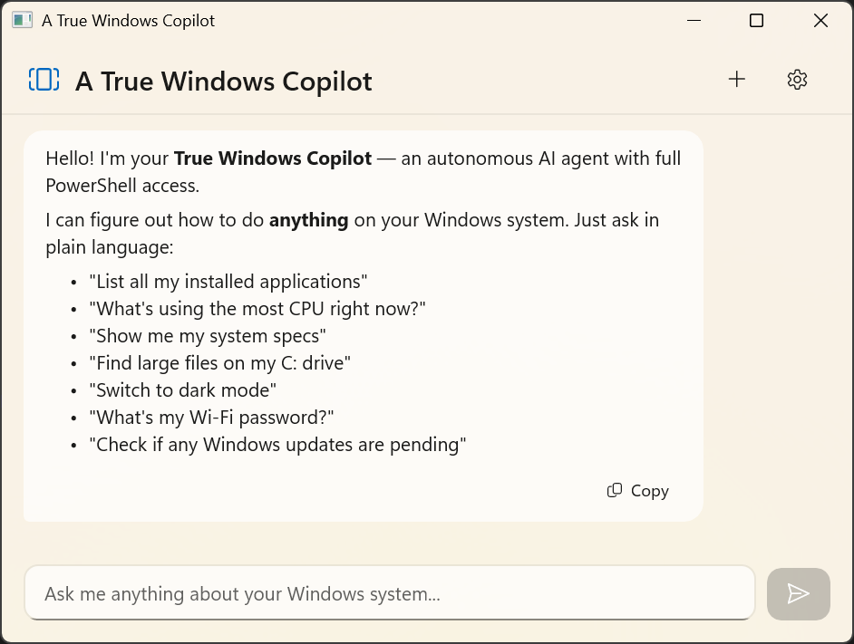
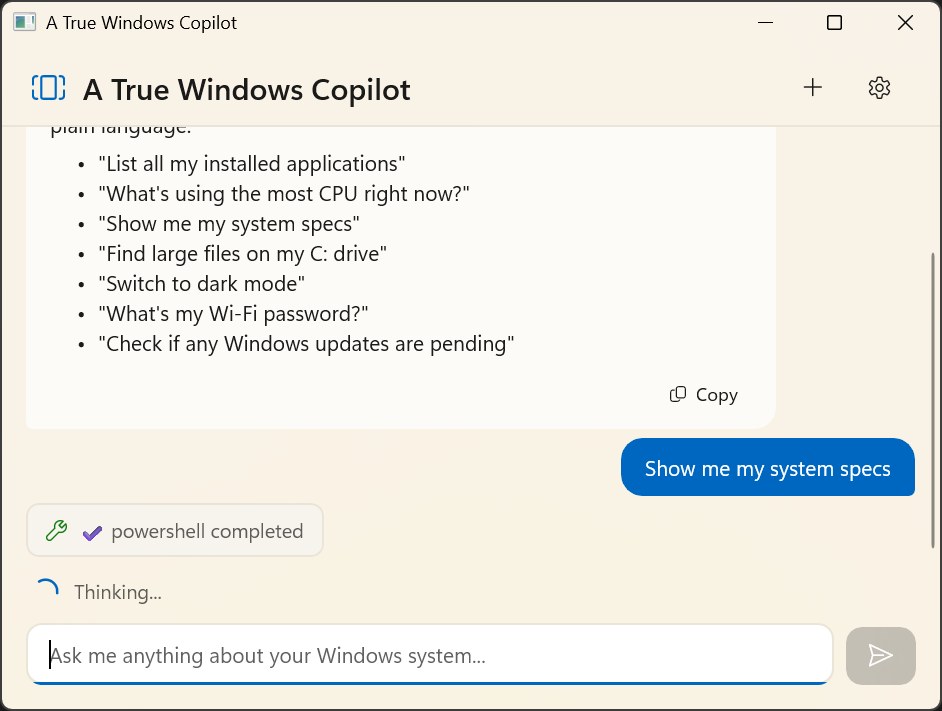
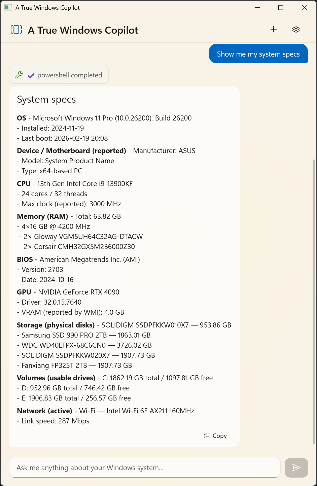

# A True Windows Copilot

An autonomous AI agent that controls your Windows system through natural language. It writes and executes PowerShell scripts on-the-fly — no pre-coded operations, no limitations. Ask it anything, and it figures out how.

## Motivation

My new work laptop came loaded with a bunch of software and tools that had nothing to do with development. I wanted an AI to help me identify and uninstall all the irrelevant ones.

I knew Microsoft had a **Windows Copilot**, so I tried it — and asked it to help me clean up. It told me it couldn't do that, and instead wrote me a step-by-step tutorial on how to manually uninstall apps myself. That was... more or less frustrating.

So I opened **VS Code** and used **GitHub Copilot** to get the job done — and it worked. But GitHub Copilot doesn't have a standalone version; it lives inside a development tool, which makes running everyday system tasks through it feel a bit awkward.

That got me thinking: *why not let GitHub Copilot hatch a True Windows Copilot?*

And so this project was born. **It was 100% written by GitHub Copilot.**

> **Note:** This project is a **complement** to Windows Copilot, not a replacement. We understand that Windows Copilot limits direct system operations for good security reasons. This app targets power users who want deeper control and accept the associated risks.

> **⚠️ Experimental Software:** This software has no intention of damaging your system. However, AI-generated actions are not 100% predictable. While we've built safety measures (revertible changes, confirmation for irreversible operations), unintended results are still possible. **Use at your own risk.**

Built with **WinUI 3 + Windows App SDK 1.8 + .NET 10**.


---

## Screenshots





---

## How It Works

The AI has full PowerShell access and autonomously writes the right scripts for any task. It supports **multi-round tool chaining** — up to 10 calls per turn. If one approach fails, it reads the error, adapts, and retries.

Every system modification is recorded with a **revert script**, so you can undo any change by simply asking. Irreversible operations (uninstall, permanent delete, etc.) require explicit **user confirmation** via a dialog before executing.

### Tools

| Tool | Purpose |
|---|---|
| `powershell` | Read-only queries — the AI writes any PowerShell script to gather information. |
| `system_change` | System modifications — executes a script and records a revert script for undo. |
| `revert_change` | Undoes a previous change by executing its recorded revert script. |
| `list_changes` | Lists all changes made in the session and their revert status. |
| `launch_application` | Opens apps, URLs, or Windows tools via ShellExecute. |

### What You Can Ask

The AI figures out the approach itself. A few examples:

- "List all installed applications"
- "What's eating my CPU?"
- "Show my system specs"
- "Switch to dark mode" *(revertible)*
- "Kill all notepad processes" *(revertible)*
- "What's my Wi-Fi password?"
- "Find .pdf files in my Downloads"
- "How much disk space is left?"
- "Open Task Manager"
- "Check for pending Windows updates"
- "What services are running?"
- "Create a scheduled task that runs daily"

And anything else PowerShell can do.

### UI

- Mica backdrop, Fluent Design
- Markdown rendering for AI responses (bold, lists, tables, code blocks with syntax highlighting)
- Distinct chat bubbles for user, assistant, and tool messages
- Real-time tool execution indicators
- Settings dialog, new chat button

---

## Download & Run

1. Download `TrueWindowsCopilot-win-x64.zip` (or `win-arm64`)
2. Extract anywhere
3. Run `TrueWindowsCopilot.exe`
4. Click ⚙️ (top-right) to enter your API key, base URL, and model name

Requires [.NET 10 Runtime](https://dotnet.microsoft.com/download/dotnet/10.0) and [Windows App Runtime 1.8](https://learn.microsoft.com/en-us/windows/apps/windows-app-sdk/downloads) installed on the target machine.

Supports OpenAI, Azure OpenAI, and any OpenAI-compatible endpoint.

### Requirements

- Windows 10 2004+ or Windows 11 (x64 / ARM64)
- [.NET 10 Desktop Runtime](https://dotnet.microsoft.com/download/dotnet/10.0)
- [Windows App Runtime 1.8](https://learn.microsoft.com/en-us/windows/apps/windows-app-sdk/downloads)
- PowerShell 5.1 (built-in) or [7+](https://learn.microsoft.com/en-us/powershell/scripting/install/installing-powershell-on-windows) (recommended, auto-detected)
- Internet for API calls; all system operations run locally

---

## Development

### Prerequisites

- [.NET 10 SDK](https://dotnet.microsoft.com/download/dotnet/10.0)
- [VS Code](https://code.visualstudio.com/) + [C# Dev Kit](https://marketplace.visualstudio.com/items?itemName=ms-dotnettools.csdevkit), or Visual Studio 2022 17.12+

### Quick Start

```bash
git clone https://github.com/your-username/a-true-windows-copilot.git
cd a-true-windows-copilot

cp src/TrueWindowsCopilot/appsettings.template.json src/TrueWindowsCopilot/appsettings.json
# Edit appsettings.json — add your API key

dotnet build src/TrueWindowsCopilot/TrueWindowsCopilot.csproj -c Debug -p:Platform=x64
dotnet run --project src/TrueWindowsCopilot/TrueWindowsCopilot.csproj -p:Platform=x64
```

Or press **F5** in VS Code.

### Architecture

```
User ──► ChatViewModel ──► OpenAI API (function calling)
              │                      │
              │                 Tool Calls
              │                      │
              ◄── ToolOrchestrator ◄─┘
                      │
            ┌─────────┼──────────┐
            │         │          │
        powershell  system_change  launch_application
        (read)    (write+revert)    (GUI)
                      │
                [irreversible?]
                      │
                Confirmation Dialog
```

### VS Code Tasks

| Task | Description |
|---|---|
| `build` (Ctrl+Shift+B) | Debug build x64 |
| `build-release` | Release build x64 |
| `publish (x64)` | Self-contained publish |
| `publish (ARM64)` | Self-contained publish |
| `publish + zip (x64 / ARM64 / ALL)` | Publish + zip for distribution |

### Adding Custom Tools

The AI handles most tasks via PowerShell. To add a native tool:

1. Implement `IWindowsTool` in `Services/Windows/`
2. Register in `App.xaml.cs`: `services.AddSingleton<IWindowsTool, YourService>()`

The AI discovers and uses it automatically.

### Tech Stack

| | |
|---|---|
| UI | WinUI 3, Windows App SDK 1.8 |
| Runtime | .NET 10 |
| MVVM | CommunityToolkit.Mvvm 8.4 |
| Markdown | CommunityToolkit.WinUI.UI.Controls.Markdown |
| DI | Microsoft.Extensions.DependencyInjection |
| AI | OpenAI Chat Completions API + function calling |
| System | PowerShell 7+/5.1 (auto-detected), ShellExecute |

---

## License

MIT
